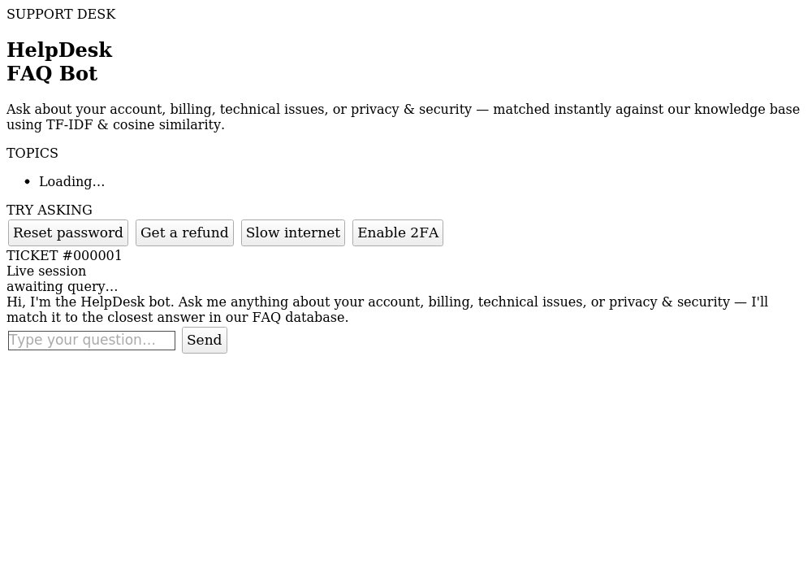

# 🤖 CodeAlpha_FAQ_Chatbot

**CodeAlpha Artificial Intelligence Internship — Task 2: Chatbot for FAQs**

A web-based FAQ chatbot that matches user questions to the closest answer in a knowledge base using **NLP preprocessing (NLTK)** and **TF-IDF + cosine similarity**, served through a **Flask** backend with a custom chat UI.


---

## 📸 Preview



*(Screenshot: the chat panel on the right, FAQ topics and quick-ask chips on the left ticket stub.)*

---

## 📖 Overview

This project fulfills **Task 2 (Chatbot for FAQs)** of the CodeAlpha AI internship:

> Collect FAQs related to a topic, preprocess the text using NLP libraries, match user questions with the most similar FAQ using cosine similarity, and display the best matching answer through a chat UI.

The bot is built around an **IT Helpdesk / customer support** FAQ set (20 Q&A pairs across 5 categories: Account, Billing, Technical, Support, Privacy & Security), but the architecture is fully **topic-agnostic** — swap `data/faqs.json` for any other domain (college admissions, a product, a course, etc.) and the bot works unchanged.

### How it works, end to end

```
User types a question
        │
        ▼
 preprocess.py   → lowercase, strip punctuation, tokenize (NLTK),
                    remove stopwords, lemmatize
        │
        ▼
 matcher.py      → vectorize with TF-IDF (unigrams + bigrams),
                    compute cosine similarity against every
                    stored FAQ question (+ keyword hints)
        │
        ▼
 Best match ≥ confidence threshold (0.20)?
        │
   ┌────┴────┐
  YES         NO
   │           │
   ▼           ▼
Return the   Return a friendly
FAQ's real   fallback message
answer       asking to rephrase
        │
        ▼
 app.py (Flask)  → JSON API + renders the chat UI
        │
        ▼
 script.js       → renders chat bubbles, shows match
                    confidence & matched category
```

---

## ✨ Features

- **Real NLP preprocessing** — tokenization, stopword removal, and lemmatization via NLTK (not just string matching).
- **TF-IDF + cosine similarity matching**, with unigrams *and* bigrams so short phrases like "reset password" are captured, not just single words.
- **Keyword augmentation** — each FAQ can carry extra keyword hints (e.g. "paypal", "2fa") pulled from its answer, so the bot still matches queries that use terms which only appear in the answer text, not the stored question.
- **Confidence-based fallback** — if the best match scores below a threshold, the bot admits it isn't sure instead of guessing, and shows the query's confidence score in the UI for transparency.
- **REST API** (`/api/chat`, `/api/categories`, `/api/health`) — decoupled from the UI, so it's easy to plug into a different frontend, a Slack bot, WhatsApp, etc.
- **Custom "support ticket" themed chat UI** — no framework, plain HTML/CSS/JS, fully responsive.
- **Unit tested** — 16 tests covering preprocessing, matching accuracy, fallback behavior, and the Flask API itself.
- **Easy to extend** — add new FAQs by editing one JSON file; no retraining or code changes required.

---

## 🗂️ Project Structure

```
CodeAlpha_FAQ_Chatbot/
├── app.py                  # Flask app: routes + REST API
├── chatbot/
│   ├── __init__.py
│   ├── preprocess.py       # NLTK-based text cleaning pipeline
│   └── matcher.py          # TF-IDF vectorization + cosine similarity matching
├── data/
│   └── faqs.json           # FAQ knowledge base (question, answer, category, keywords)
├── static/
│   ├── style.css           # Chat UI styling
│   └── script.js           # Chat UI logic (fetch, render bubbles, etc.)
├── templates/
│   └── index.html          # Chat UI markup
├── tests/
│   └── test_chatbot.py     # Unit tests (pytest / unittest)
├── docs/
│   └── screenshot.png      # UI preview used in this README
├── requirements.txt
├── .gitignore
├── LICENSE
└── README.md
```

---

## 🚀 Getting Started

### 1. Clone the repository

```bash
git clone https://github.com/<your-username>/CodeAlpha_FAQ_Chatbot.git
cd CodeAlpha_FAQ_Chatbot
```

### 2. Create a virtual environment (recommended)

```bash
python -m venv venv
source venv/bin/activate      # on Windows: venv\Scripts\activate
```

### 3. Install dependencies

```bash
pip install -r requirements.txt
```

### 4. Run the app

```bash
python app.py
```

The first run automatically downloads the small NLTK corpora it needs (`punkt`, `punkt_tab`, `stopwords`, `wordnet`) — this requires an internet connection once, after which everything runs offline.

Then open **http://127.0.0.1:5000** in your browser and start chatting.

### 5. Run the tests

```bash
pip install pytest
pytest tests/ -v
```

---

## 🔌 API Reference

### `POST /api/chat`

**Request**
```json
{ "message": "How do I reset my password?" }
```

**Response**
```json
{
  "answer": "Go to the login page and click 'Forgot Password'...",
  "matched": true,
  "matched_question": "How do I reset my password?",
  "category": "Account",
  "confidence": 0.785
}
```

### `GET /api/categories`
Returns the list of FAQ categories currently loaded.

### `GET /api/health`
Simple health check — returns `{"status": "ok", "faq_count": 20}`.

---

## 🧩 Adding Your Own FAQs

Edit `data/faqs.json` — each entry looks like:

```json
{
  "id": 21,
  "question": "How do I upgrade my plan?",
  "answer": "Go to Account Settings > Subscription > Upgrade, and pick your new plan. The price difference is prorated for the current billing cycle.",
  "category": "Billing",
  "keywords": ["upgrade plan", "change plan"]
}
```

No retraining step is required — the TF-IDF vectorizer is refit automatically the next time the app starts (or call `FAQMatcher.reload()` at runtime).

---

## 🛠️ Tech Stack

| Layer            | Technology                                  |
|-------------------|---------------------------------------------|
| NLP preprocessing | NLTK (tokenization, stopwords, lemmatization) |
| Matching engine   | scikit-learn (`TfidfVectorizer`, `cosine_similarity`) |
| Backend           | Flask (Python)                              |
| Frontend          | HTML5, CSS3, vanilla JavaScript             |
| Testing           | pytest / unittest                           |

---

## 📤 Pushing This to GitHub (CodeAlpha submission)

CodeAlpha requires the repo to be named `CodeAlpha_ProjectName`. This folder is already named `CodeAlpha_FAQ_Chatbot`, so from inside it:

```bash
git init
git add .
git commit -m "CodeAlpha AI Internship - Task 2: Chatbot for FAQs"
git branch -M main
git remote add origin https://github.com/<your-username>/CodeAlpha_FAQ_Chatbot.git
git push -u origin main
```

1. Create the empty repository on GitHub first (name it exactly `CodeAlpha_FAQ_Chatbot`), **without** a README/license/gitignore (this project already has them — avoids a merge conflict on first push).
2. Copy the repo URL GitHub gives you and use it in `git remote add origin ...` above.
3. Once pushed, your repo link will be `https://github.com/<your-username>/CodeAlpha_FAQ_Chatbot` — that's the link you'll share on LinkedIn and in the submission form.

---

## 📋 CodeAlpha Submission Checklist

- [x] Collected FAQs (20 Q&A pairs, 5 categories) — `data/faqs.json`
- [x] Preprocessed text using an NLP library (NLTK) — `chatbot/preprocess.py`
- [x] Matched user questions via cosine similarity — `chatbot/matcher.py`
- [x] Displayed the best matching answer as a chatbot response — Flask + `templates/index.html`
- [x] Simple chat UI for user interaction (optional task item) — done
- [ ] Push this repo to GitHub as `CodeAlpha_ProjectName` (rename to e.g. `CodeAlpha_FAQ_Chatbot`)
- [ ] Record a short video walkthrough and post it on LinkedIn tagging @CodeAlpha, with the GitHub link
- [ ] Submit via the internship submission form

---

## 📄 License

This project is released under the [MIT License](LICENSE).

## 🙋 Author

Built as part of the CodeAlpha Artificial Intelligence Internship program.
Feel free to fork, extend, and reuse for your own FAQ/support use cases.
